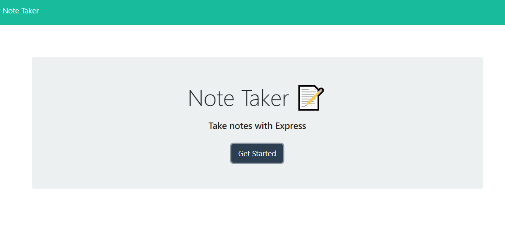
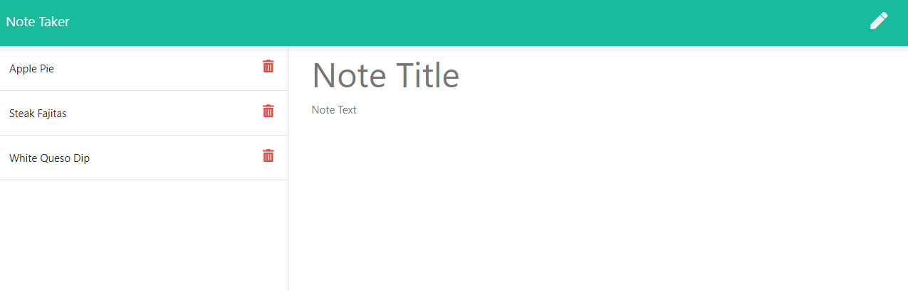
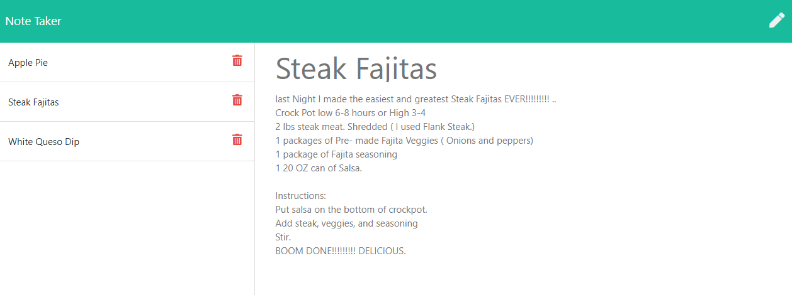

# Note Taker

[](https://opensource.org/licenses/MIT)       


## Description

Create an application that can be used to write, save, and delete notes. This application will use an express backend and save and retrieve note data from a JSON file.

## Table of Contents
* [Installation](#installation)
* [Usage](#usage)
* [License](#license)


## Installation

To install dependencies, run the following:

```
npm i
```

### Built with
* Javascript
* HTML
* CSS
* [npm](https://nodejs.org/en/)
* [npm express](https://www.npmjs.com/package/express)
* [Visual Studio Code](code.visualstudio.com)
* [Heroku](www.heroku.com)


The application frontend was already been created, this project was to build the backend and connect the two.

The following HTML routes were created:
* GET /notes - Should return the notes.html file.
* GET * - Should return the index.html file

The application has a db.json file on the backend that will be used to store and retrieve notes using the fs module.

The following API routes were created:
* GET /api/notes - Reads the db.json file and return all saved notes as JSON.
* POST /api/notes - Receives a new note to save on the request body, add it to the db.json file, and then return the new note to the client.
* DELETE /api/notes/:id - Receives a query parameter containing the id of a note to delete. This means you'll need to find a way to give each note a unique id when it's saved. In order to delete a note, you'll need to read all notes from the db.json file, remove the note with the given id property, and then rewrite the notes to the db.json file.

## Usage

This application is for users needing to keep track of a lot of information, it is easy to forget or be unable to recall something important. Being able to take persistent notes allows users to have written information available when needed.

This application was deployed in Heroku.

### Note Taker Link in Heroku
[Note Taker Link](https://vast-brook-30237.herokuapp.com/)

### Note Taker Screenshot 1


### Note Taker Screenshot 2


### Note Taker Screenshot 3



## License


This repository is licensed under the MIT License.
[](https://opensource.org/licenses/MIT)

